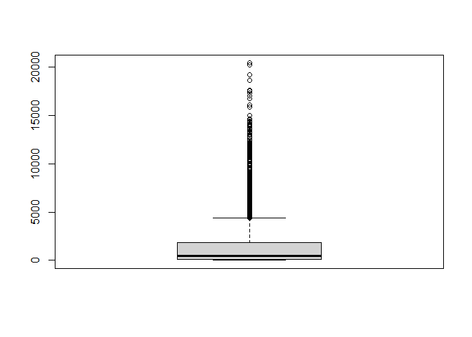

SYS 6021 Final Project
================
Andres Izquierdo
12/6/2021

# 1. Introduction

This project will be exploring Major League Baseball (MLB) data using
Lahman’s Baseball Database which contains complete batting and pitching
statistics from 1871 to 2020, plus fielding statistics, standings, team
stats, managerial records, post-season data, and more. This project will
look at career pitching statistics in particular and come up with which
variables will be best for using as predictors, using binary logistic
regression, in determining which current pitchers will be inducted into
the Hall of Fame (HOF). The motivation behind this project besides being
a big baseball fan is to use the logistic model with the best indicators
to determine which of the best current pitchers will be inducted into
the hall of fame. Baseball is known as a numbers game, with analytics
influencing every decision in the league, the most famous example being
Michael Lewis’ book “Moneyball: The Art of Winning an Unfair Game” which
was adapted into a movie. In the following sections the data used from
these databases will be cleaned and formatted before using visualization
analysis to come up with the hypothesis of this project to test and
perform analysis on.

# 2. Analysis

## Data Cleaning

``` r
# Dataframe variable meanings can be found here on
# http://www.seanlahman.com/files/database/readme2017.txt
# on '2.3 Pitching Table'.


Pitcher <- Pitching %>%
    distinct(playerID, .keep_all = TRUE)

# Getting rid of any na Values, this removes all data
# before 1973 as the stat GIDP was not counted before then.
pitch.complete <- na.omit(Pitching)
# Changing the stint column into the seasons column to
# count how many seasons each pitcher has.
pitch.complete$stint <- 1
names(pitch.complete)[3] <- "Seasons"

# Mutating all rows to be the career statistics for each
# pitcher.
df <- group_by(pitch.complete, playerID)
pitchers <- df %>%
    mutate(Seasons = sum(Seasons), W = sum(W), L = sum(L), G = sum(G),
        GS = sum(GS), CG = sum(CG), SHO = sum(SHO), SV = sum(SV),
        IPouts = sum(IPouts), H = sum(H), ER = sum(ER), HR = sum(HR),
        BB = sum(BB), SO = sum(SO), BAOpp = mean(BAOpp), ERA = mean(ERA),
        IBB = sum(IBB), WP = sum(WP), HBP = sum(HBP), BK = sum(BK),
        BFP = sum(BFP), GF = sum(GF), R = sum(R), SH = sum(SH),
        SF = sum(SF), GIDP = sum(GIDP))

# Removing all duplicate names since we are only looking at
# each pitchers career statistic.
Pitcher.Career.Statistics <- pitchers %>%
    distinct(playerID, .keep_all = TRUE)

# Filtering put Hall Of Fame dataframe to include Players
# only.
HoFers <- HallOfFame %>%
    filter(category == "Player", inducted == "Y")

# Adding HOF indicator into main Data Frame.
Pitcher.Career.Statistics <- Pitcher.Career.Statistics %>%
    left_join(HoFers, by = "playerID")

# Removing unecessary columns.
Pitcher.Career.Statistics <- subset(Pitcher.Career.Statistics,
    select = -c(yearID.y, votedBy, ballots, needed, votes, needed_note,
        category, yearID.x, teamID, lgID))

# Replacing NA's with N since the pitcher has not goten
# into the HOF either because the pitcher was not eligible,
# not voted in, or is still an active player.
Pitcher.Career.Statistics <- Pitcher.Career.Statistics %>%
    replace_na(list(inducted = "N"))

# Turning HOF indicator into 1,0
Pitcher.Career.Statistics$inducted <- ifelse(Pitcher.Career.Statistics$inducted ==
    "Y", 1, 0)
```

## Vizualization

``` r
# Proportion of pitchers in the hall of fame.
sum(Pitcher.Career.Statistics[, 28])/nrow(Pitcher.Career.Statistics)
```

    ## [1] 0.004457652

``` r
sum(Pitcher.Career.Statistics[, 28])
```

    ## [1] 24

``` r
nrow(Pitcher.Career.Statistics)
```

    ## [1] 5384

``` r
# CG, W, SHO, and IPouts are the most correlated with the
# inducted response variable in this scatterplot matrix.
pairs.panels(Pitcher.Career.Statistics[, c(2:11, 28)])
```

<!-- -->

``` r
# SO and BB are the most correlated with the inducted
# response variable in this scatterplot matrix.
pairs.panels(Pitcher.Career.Statistics[, c(12:21, 28)])
```

<!-- -->

``` r
# SH and BFP are the most correlated with the inducted
# response variable in this scatterplot matrix.
pairs.panels(Pitcher.Career.Statistics[, c(22:27, 28)])
```

<!-- -->

``` r
Pitcher.Career.Statistics.vi <- copy(Pitcher.Career.Statistics)
Pitcher.Career.Statistics.vi <- setnames(Pitcher.Career.Statistics.vi,
    old = c("Seasons", "W", "L", "G", "GS", "CG", "SHO", "SV",
        "IPouts", "H", "ER", "HR", "BB", "SO", "BAOpp", "ERA",
        "IBB", "WP", "HBP", "BK", "BFP", "GF", "R", "SH", "SF",
        "GIDP", "inducted"), new = c("v1", "v2", "v3", "v4",
        "v5", "v6", "v7", "v8", "v9", "v10", "v11", "v12", "v13",
        "v14", "v15", "v16", "v17", "v18", "v19", "v20", "v21",
        "v22", "v23", "v24", "v25", "v26", "v27"))

# Setting up box plots.
v1 <- ggplot(Pitcher.Career.Statistics.vi, aes(x = as.factor(Pitcher.Career.Statistics.vi$v27),
    y = v1)) + geom_boxplot(fill = "steelblue") + labs(x = "Inducted in HOF") +
    labs(y = "Seasons")
v2 <- ggplot(Pitcher.Career.Statistics.vi, aes(x = as.factor(Pitcher.Career.Statistics.vi$v27),
    y = v2)) + geom_boxplot(fill = "steelblue") + labs(x = "Inducted in HOF") +
    labs(y = "W")
v3 <- ggplot(Pitcher.Career.Statistics.vi, aes(x = as.factor(Pitcher.Career.Statistics.vi$v27),
    y = v3)) + geom_boxplot(fill = "steelblue") + labs(x = "Inducted in HOF") +
    labs(y = "L")
v4 <- ggplot(Pitcher.Career.Statistics.vi, aes(x = as.factor(Pitcher.Career.Statistics.vi$v27),
    y = v4)) + geom_boxplot(fill = "steelblue") + labs(x = "Inducted in HOF") +
    labs(y = "G")
v5 <- ggplot(Pitcher.Career.Statistics.vi, aes(x = as.factor(Pitcher.Career.Statistics.vi$v27),
    y = v5)) + geom_boxplot(fill = "steelblue") + labs(x = "Inducted in HOF") +
    labs(y = "GS")
v6 <- ggplot(Pitcher.Career.Statistics.vi, aes(x = as.factor(Pitcher.Career.Statistics.vi$v27),
    y = v6)) + geom_boxplot(fill = "steelblue") + labs(x = "Inducted in HOF") +
    labs(y = "CG")
v7 <- ggplot(Pitcher.Career.Statistics.vi, aes(x = as.factor(Pitcher.Career.Statistics.vi$v27),
    y = v7)) + geom_boxplot(fill = "steelblue") + labs(x = "Inducted in HOF") +
    labs(y = "SHO")
v8 <- ggplot(Pitcher.Career.Statistics.vi, aes(x = as.factor(Pitcher.Career.Statistics.vi$v27),
    y = v8)) + geom_boxplot(fill = "steelblue") + labs(x = "Inducted in HOF") +
    labs(y = "SV")
v9 <- ggplot(Pitcher.Career.Statistics.vi, aes(x = as.factor(Pitcher.Career.Statistics.vi$v27),
    y = v9)) + geom_boxplot(fill = "steelblue") + labs(x = "Inducted in HOF") +
    labs(y = "IPouts")
v10 <- ggplot(Pitcher.Career.Statistics.vi, aes(x = as.factor(Pitcher.Career.Statistics.vi$v27),
    y = v10)) + geom_boxplot(fill = "steelblue") + labs(x = "Inducted in HOF") +
    labs(y = "H")
v11 <- ggplot(Pitcher.Career.Statistics.vi, aes(x = as.factor(Pitcher.Career.Statistics.vi$v27),
    y = v11)) + geom_boxplot(fill = "steelblue") + labs(x = "Inducted in HOF") +
    labs(y = "ER")
v12 <- ggplot(Pitcher.Career.Statistics.vi, aes(x = as.factor(Pitcher.Career.Statistics.vi$v27),
    y = v12)) + geom_boxplot(fill = "steelblue") + labs(x = "Inducted in HOF") +
    labs(y = "HR")
v13 <- ggplot(Pitcher.Career.Statistics.vi, aes(x = as.factor(Pitcher.Career.Statistics.vi$v27),
    y = v13)) + geom_boxplot(fill = "steelblue") + labs(x = "Inducted in HOF") +
    labs(y = "BB")
v14 <- ggplot(Pitcher.Career.Statistics.vi, aes(x = as.factor(Pitcher.Career.Statistics.vi$v27),
    y = v14)) + geom_boxplot(fill = "steelblue") + labs(x = "Inducted in HOF") +
    labs(y = "SO")
v15 <- ggplot(Pitcher.Career.Statistics.vi, aes(x = as.factor(Pitcher.Career.Statistics.vi$v27),
    y = v15)) + geom_boxplot(fill = "steelblue") + labs(x = "Inducted in HOF") +
    labs(y = "BAOpp")
v16 <- ggplot(Pitcher.Career.Statistics.vi, aes(x = as.factor(Pitcher.Career.Statistics.vi$v27),
    y = v16)) + geom_boxplot(fill = "steelblue") + labs(x = "Inducted in HOF") +
    labs(y = "ERA")
v17 <- ggplot(Pitcher.Career.Statistics.vi, aes(x = as.factor(Pitcher.Career.Statistics.vi$v27),
    y = v17)) + geom_boxplot(fill = "steelblue") + labs(x = "Inducted in HOF") +
    labs(y = "IBB")
v18 <- ggplot(Pitcher.Career.Statistics.vi, aes(x = as.factor(Pitcher.Career.Statistics.vi$v27),
    y = v18)) + geom_boxplot(fill = "steelblue") + labs(x = "Inducted in HOF") +
    labs(y = "WP")
v19 <- ggplot(Pitcher.Career.Statistics.vi, aes(x = as.factor(Pitcher.Career.Statistics.vi$v27),
    y = v19)) + geom_boxplot(fill = "steelblue") + labs(x = "Inducted in HOF") +
    labs(y = "HBP")
v20 <- ggplot(Pitcher.Career.Statistics.vi, aes(x = as.factor(Pitcher.Career.Statistics.vi$v27),
    y = v20)) + geom_boxplot(fill = "steelblue") + labs(x = "Inducted in HOF") +
    labs(y = "BK")
v21 <- ggplot(Pitcher.Career.Statistics.vi, aes(x = as.factor(Pitcher.Career.Statistics.vi$v27),
    y = v21)) + geom_boxplot(fill = "steelblue") + labs(x = "Inducted in HOF") +
    labs(y = "BFP")
v22 <- ggplot(Pitcher.Career.Statistics.vi, aes(x = as.factor(Pitcher.Career.Statistics.vi$v27),
    y = v22)) + geom_boxplot(fill = "steelblue") + labs(x = "Inducted in HOF") +
    labs(y = "GF")
v23 <- ggplot(Pitcher.Career.Statistics.vi, aes(x = as.factor(Pitcher.Career.Statistics.vi$v27),
    y = v23)) + geom_boxplot(fill = "steelblue") + labs(x = "Inducted in HOF") +
    labs(y = "R")
v24 <- ggplot(Pitcher.Career.Statistics.vi, aes(x = as.factor(Pitcher.Career.Statistics.vi$v27),
    y = v24)) + geom_boxplot(fill = "steelblue") + labs(x = "Inducted in HOF") +
    labs(y = "SH")
v25 <- ggplot(Pitcher.Career.Statistics.vi, aes(x = as.factor(Pitcher.Career.Statistics.vi$v27),
    y = v25)) + geom_boxplot(fill = "steelblue") + labs(x = "Inducted in HOF") +
    labs(y = "SF")
v26 <- ggplot(Pitcher.Career.Statistics.vi, aes(x = as.factor(Pitcher.Career.Statistics.vi$v27),
    y = v26)) + geom_boxplot(fill = "steelblue") + labs(x = "Inducted in HOF") +
    labs(y = "GIDP")


# Arranging Box plots
ggarrange(v1, v2, v3, v4, v5, v6, v7, v8, v9, ncol = 3, nrow = 3)
```

<!-- -->

``` r
ggarrange(v11, v12, v13, v14, v15, v16, v17, v18, v19, ncol = 3,
    nrow = 3)
```

<!-- -->

``` r
ggarrange(v21, v22, v23, v24, v25, v26, ncol = 3, nrow = 2)
```

<!-- -->

``` r
# Principal Component Analysis Column 1 is the player id
# and column 28 is the response variable.
Pitcher.Career.Statistics.pca = princomp(Pitcher.Career.Statistics[,
    2:27], cor = T)
biplot(Pitcher.Career.Statistics.pca)
```

<!-- -->

``` r
ggbiplot(Pitcher.Career.Statistics.pca, varname.size = 5, labels = row(Pitcher.Career.Statistics)[,
    1])
```

<!-- -->

``` r
# Identifying Outlier
barplot(Pitcher.Career.Statistics.pca$loadings[, 2])
```

<!-- -->

``` r
summary(Pitcher.Career.Statistics[, which(Pitcher.Career.Statistics.pca$loadings[,
    2] > 0.2)])
```

    ##    playerID               L               SHO               ERA        
    ##  Length:5384        Min.   :  0.00   Min.   : 0.0000   Min.   : 0.000  
    ##  Class :character   1st Qu.:  1.00   1st Qu.: 0.0000   1st Qu.: 4.015  
    ##  Mode  :character   Median :  5.00   Median : 0.0000   Median : 4.950  
    ##                     Mean   : 19.58   Mean   : 0.9786   Mean   : 6.220  
    ##                     3rd Qu.: 25.00   3rd Qu.: 0.0000   3rd Qu.: 6.570  
    ##                     Max.   :238.00   Max.   :51.0000   Max.   :96.360  
    ##       BFP         
    ##  Min.   :    1.0  
    ##  1st Qu.:  102.0  
    ##  Median :  455.5  
    ##  Mean   : 1502.2  
    ##  3rd Qu.: 1817.5  
    ##  Max.   :20421.0

``` r
Pitcher.Career.Statistics[953, which(Pitcher.Career.Statistics.pca$loadings[,
    2] > 0.2)]
```

    ## # A tibble: 1 x 5
    ## # Groups:   playerID [1]
    ##   playerID      L   SHO   ERA   BFP
    ##   <chr>     <int> <int> <dbl> <int>
    ## 1 cocanja01    25     1  3.64  1628

``` r
boxplot(Pitcher.Career.Statistics$BFP)
```

<!-- -->

``` r
# Removing Outlier which is observation 953.
Pitcher.Career.Statistics.pca = princomp(Pitcher.Career.Statistics[-953,
    2:27], cor = T)

biplot.fact(Pitcher.Career.Statistics.pca, Pitcher.Career.Statistics[-953,
    28])
legend(15, 10, legend = c("HOF", "NO"), pch = c(18, 19), col = c("red",
    "blue"))
```

<!-- -->

## Selecting Variables For Hypothesis

Per the analysis done in the section above the variables I will select
for my hypothesis as significant predictors towards identifying players
who will be inducted into the Hall of Fame are: CG, W, SHO, IPouts, SO,
BB, SH, and BFP. These Variables showed the most correlation in the
Scatterplot Matrix and in the Box plot Indicators. The PCA biplots show
a big clump of variables all pointing in the same direction as well as
some orthogonal variables that are linearly uncorrelated. In the last
biplot we can see a slight orthogonal direction taken in between the
player who were inducted into the HOF and the players who were not. My
hypothesis for this project will be that the variables I selected using
visualization techniques will be better at predicting pitchers that get
inducted into the Hall of Fame than the significant variables from the
main effects model.

## Main Effects and Null Model

``` r
# Setting up Main effect model
pitch <- copy(Pitcher.Career.Statistics)
pitch$playerID <- NULL  # Getting rid of playerID column.
pitch.glm.main <- glm(inducted ~ ., data = pitch, family = binomial)
```

    ## Warning: glm.fit: fitted probabilities numerically 0 or 1 occurred

``` r
summary(pitch.glm.main)
```

    ## 
    ## Call:
    ## glm(formula = inducted ~ ., family = binomial, data = pitch)
    ## 
    ## Deviance Residuals: 
    ##     Min       1Q   Median       3Q      Max  
    ## -1.5365  -0.0308  -0.0176  -0.0048   4.1353  
    ## 
    ## Coefficients:
    ##               Estimate Std. Error z value Pr(>|z|)   
    ## (Intercept) -7.1049557  2.5432368  -2.794  0.00521 **
    ## Seasons     -0.3004823  0.4484171  -0.670  0.50280   
    ## W            0.0673318  0.0702601   0.958  0.33790   
    ## L           -0.0651551  0.0850176  -0.766  0.44345   
    ## G           -0.0447540  0.0287361  -1.557  0.11937   
    ## GS          -0.1084802  0.0661008  -1.641  0.10077   
    ## CG           0.0838803  0.0508365   1.650  0.09894 . 
    ## SHO         -0.4057171  0.1618364  -2.507  0.01218 * 
    ## SV           0.0939635  0.0474496   1.980  0.04767 * 
    ## IPouts       0.0118678  0.0336681   0.352  0.72447   
    ## H           -0.0152650  0.0285031  -0.536  0.59226   
    ## ER          -0.0273104  0.0460270  -0.593  0.55294   
    ## HR           0.0424832  0.0234718   1.810  0.07030 . 
    ## BB          -0.0015599  0.0282501  -0.055  0.95597   
    ## SO          -0.0008576  0.0019907  -0.431  0.66662   
    ## BAOpp        0.6894588 10.2112620   0.068  0.94617   
    ## ERA         -0.0090512  0.1483004  -0.061  0.95133   
    ## IBB          0.0952374  0.0404054   2.357  0.01842 * 
    ## WP          -0.0013911  0.0268591  -0.052  0.95869   
    ## HBP          0.0318933  0.0348270   0.916  0.35979   
    ## BK          -0.1375695  0.0688379  -1.998  0.04567 * 
    ## BFP         -0.0007202  0.0324229  -0.022  0.98228   
    ## GF          -0.0341253  0.0526931  -0.648  0.51723   
    ## R            0.0235635  0.0488670   0.482  0.62967   
    ## SH           0.0882554  0.0436350   2.023  0.04312 * 
    ## SF          -0.0138223  0.0669313  -0.207  0.83639   
    ## GIDP        -0.0063391  0.0346774  -0.183  0.85495   
    ## ---
    ## Signif. codes:  0 '***' 0.001 '**' 0.01 '*' 0.05 '.' 0.1 ' ' 1
    ## 
    ## (Dispersion parameter for binomial family taken to be 1)
    ## 
    ##     Null deviance: 307.723  on 5383  degrees of freedom
    ## Residual deviance:  65.307  on 5357  degrees of freedom
    ## AIC: 119.31
    ## 
    ## Number of Fisher Scoring iterations: 12

``` r
# Setting up Null Model
pitch.null <- glm(inducted ~ 1, data = pitch, family = binomial)
summary(pitch.null)
```

    ## 
    ## Call:
    ## glm(formula = inducted ~ 1, family = binomial, data = pitch)
    ## 
    ## Deviance Residuals: 
    ##     Min       1Q   Median       3Q      Max  
    ## -0.0945  -0.0945  -0.0945  -0.0945   3.2903  
    ## 
    ## Coefficients:
    ##             Estimate Std. Error z value Pr(>|z|)    
    ## (Intercept)  -5.4087     0.2046  -26.44   <2e-16 ***
    ## ---
    ## Signif. codes:  0 '***' 0.001 '**' 0.01 '*' 0.05 '.' 0.1 ' ' 1
    ## 
    ## (Dispersion parameter for binomial family taken to be 1)
    ## 
    ##     Null deviance: 307.72  on 5383  degrees of freedom
    ## Residual deviance: 307.72  on 5383  degrees of freedom
    ## AIC: 309.72
    ## 
    ## Number of Fisher Scoring iterations: 8

``` r
anova(pitch.null, pitch.glm.main, test = "Chi")
```

    ## Analysis of Deviance Table
    ## 
    ## Model 1: inducted ~ 1
    ## Model 2: inducted ~ Seasons + W + L + G + GS + CG + SHO + SV + IPouts + 
    ##     H + ER + HR + BB + SO + BAOpp + ERA + IBB + WP + HBP + BK + 
    ##     BFP + GF + R + SH + SF + GIDP
    ##   Resid. Df Resid. Dev Df Deviance  Pr(>Chi)    
    ## 1      5383    307.723                          
    ## 2      5357     65.307 26   242.42 < 2.2e-16 ***
    ## ---
    ## Signif. codes:  0 '***' 0.001 '**' 0.01 '*' 0.05 '.' 0.1 ' ' 1

``` r
# pitch.glm.main is the better model compared to
# pitch.null.
```

In the section above the main effects model and the null model are set
up for testing. When compared to the null model the main effect model
performs better than the null model with a big decrease in the residual
deviance meaning that we can reject the null hypothesis based on this
information. In the main effects model we see a total of seven variables
that are significant, meaning that there may be some multicollinearity
present here but not enough to where none of the variables are
significant. The seven variables that were marked as significant in the
main effect model are CG, SHO, SV, HR, IBB, BK, and SH. Of theses seven
only SHO and BK have a negative relationship with the model while the
rest have positive relationships. Three of these variable match with the
ones I came up with in my hypothesis: CG, W, SHO, IPouts, SO, BB, SH,
and BFP. In the following sections we will see how the significant main
effect indicators perform against those indicators that I selected in my
hypothesis and which have more accurate predictions.

## Model Utility

``` r
# Setting up model with selected variables based on
# visualizations.
pitch.glm.select <- glm(inducted ~ IPouts + W + SHO + BB + SH +
    CG + SO + BFP, data = pitch, family = binomial)
# Setting up model with significant variables based on the
# main effects model.
pitch.main.sig <- glm(inducted ~ CG + SHO + SV + HR + IBB + BK +
    SH, data = pitch, family = binomial)
summary(pitch.glm.select)
```

    ## 
    ## Call:
    ## glm(formula = inducted ~ IPouts + W + SHO + BB + SH + CG + SO + 
    ##     BFP, family = binomial, data = pitch)
    ## 
    ## Deviance Residuals: 
    ##     Min       1Q   Median       3Q      Max  
    ## -2.1355  -0.0358  -0.0336  -0.0294   3.8474  
    ## 
    ## Coefficients:
    ##               Estimate Std. Error z value Pr(>|z|)    
    ## (Intercept) -7.3629813  0.5598118 -13.153  < 2e-16 ***
    ## IPouts       0.0199636  0.0050600   3.945 7.97e-05 ***
    ## W            0.0414101  0.0277821   1.491 0.136085    
    ## SHO         -0.2766290  0.0730158  -3.789 0.000151 ***
    ## BB           0.0066880  0.0029628   2.257 0.023989 *  
    ## SH           0.0499267  0.0148284   3.367 0.000760 ***
    ## CG           0.0804442  0.0195035   4.125 3.71e-05 ***
    ## SO          -0.0003502  0.0010371  -0.338 0.735620    
    ## BFP         -0.0155377  0.0035903  -4.328 1.51e-05 ***
    ## ---
    ## Signif. codes:  0 '***' 0.001 '**' 0.01 '*' 0.05 '.' 0.1 ' ' 1
    ## 
    ## (Dispersion parameter for binomial family taken to be 1)
    ## 
    ##     Null deviance: 307.72  on 5383  degrees of freedom
    ## Residual deviance: 114.09  on 5375  degrees of freedom
    ## AIC: 132.09
    ## 
    ## Number of Fisher Scoring iterations: 10

``` r
anova(pitch.null, pitch.glm.select, test = "Chi")
```

    ## Analysis of Deviance Table
    ## 
    ## Model 1: inducted ~ 1
    ## Model 2: inducted ~ IPouts + W + SHO + BB + SH + CG + SO + BFP
    ##   Resid. Df Resid. Dev Df Deviance  Pr(>Chi)    
    ## 1      5383     307.72                          
    ## 2      5375     114.09  8   193.63 < 2.2e-16 ***
    ## ---
    ## Signif. codes:  0 '***' 0.001 '**' 0.01 '*' 0.05 '.' 0.1 ' ' 1

``` r
anova(pitch.main.sig, pitch.glm.select, test = "Chi")
```

    ## Analysis of Deviance Table
    ## 
    ## Model 1: inducted ~ CG + SHO + SV + HR + IBB + BK + SH
    ## Model 2: inducted ~ IPouts + W + SHO + BB + SH + CG + SO + BFP
    ##   Resid. Df Resid. Dev Df Deviance  Pr(>Chi)    
    ## 1      5376     129.34                          
    ## 2      5375     114.09  1   15.248 9.429e-05 ***
    ## ---
    ## Signif. codes:  0 '***' 0.001 '**' 0.01 '*' 0.05 '.' 0.1 ' ' 1

``` r
# Setting up Log of the models above.
Lpitch <- log(pitch[, -27] + 0.1)

Lpitch$inducted <- pitch$inducted

Lpitch.glm.select <- glm(inducted ~ IPouts + W + SHO + BB + SH +
    CG + SO + BFP, data = Lpitch, family = binomial)
```

    ## Warning: glm.fit: fitted probabilities numerically 0 or 1 occurred

``` r
Lpitch.glm.sig <- glm(inducted ~ CG + SHO + SV + HR + IBB + BK +
    SH, data = Lpitch, family = binomial)

anova(Lpitch.glm.sig, Lpitch.glm.select, test = "Chi")
```

    ## Analysis of Deviance Table
    ## 
    ## Model 1: inducted ~ CG + SHO + SV + HR + IBB + BK + SH
    ## Model 2: inducted ~ IPouts + W + SHO + BB + SH + CG + SO + BFP
    ##   Resid. Df Resid. Dev Df Deviance Pr(>Chi)    
    ## 1      5376     200.26                         
    ## 2      5375     179.00  1   21.265    4e-06 ***
    ## ---
    ## Signif. codes:  0 '***' 0.001 '**' 0.01 '*' 0.05 '.' 0.1 ' ' 1

In the Model Utility Section we set up two glm models, one with the
selected variables from our hypothesis and the other with variables that
were significant from the main effect model. The selected variables
summary has good indicators that our model is significant. We compare
the model with the selected variables to our null model and we see that
the selected variables model performs better than our null mode,
therefore we can reject the null. Now when comparing the selected model
with the significant model the selected model performs better but not by
much when comparing the residual deviances, so therefore we cannot fully
reject the significant model and would be worth keeping it and seeing
how it performs during predictions. The p-value we got here is the best
value yet doing the chi- squared tests. When doing the log of these
models we find similar results in the sense that there is no big
difference in the Residual Differences but the P-value for the selected
is better than that of the p-value for the normal selected model It is
also observed that the residual differences are also higher in the log
models when compared to the lower models, we will keep these models to
perform predictions with them as well.

## Test and Training Sets

``` r
# Setting up test and training sets.
set.seed(123)
Pitch <- test.set(pitch, 0.33)
portions <- data.frame(dataset = c("Full", "Train", "Test", "Full",
    "Train", "Test"), class = c("HOF", "HOF", "HOF", "NO", "NO",
    "NO"), portion = c(sum(pitch$inducted)/length(pitch$inducted),
    sum(Pitch$train$inducted)/length(Pitch$train$inducted), sum(Pitch$test$inducted)/length(Pitch$test$inducted),
    1 - sum(pitch$inducted)/length(pitch$inducted), 1 - sum(Pitch$train$inducted)/length(Pitch$train$inducted),
    1 - sum(Pitch$test$inducted)/length(Pitch$test$inducted)))

ggplot(portions, aes(x = dataset, y = portion, fill = class)) +
    geom_bar(stat = "identity")
```

<!-- -->

The training model that was set up using a test set comprised of a third
of the data. The Training model has a similar portions as the full and
test data, therefore it will be used to train our model.

## GLM Utility with Training Data

``` r
# Trained model with variables selected.
pitch.glm.select.train <- glm(inducted ~ IPouts + W + SHO + BB +
    SH + CG + SO + BFP, data = Pitch$train, family = binomial)

# Trained model with significant variables from main.
pitch.glm.sig.train <- glm(inducted ~ CG + SHO + SV + HR + IBB +
    BK + SH, data = Pitch$train, family = binomial)

pitch.null <- glm(inducted ~ 1, data = Pitch$train, family = binomial)

# pitch.glm.select.train model is significant enough to
# where we can reject our null hypothesis.
anova(pitch.null, pitch.glm.select.train, test = "Chi")
```

    ## Analysis of Deviance Table
    ## 
    ## Model 1: inducted ~ 1
    ## Model 2: inducted ~ IPouts + W + SHO + BB + SH + CG + SO + BFP
    ##   Resid. Df Resid. Dev Df Deviance  Pr(>Chi)    
    ## 1      3606    237.255                          
    ## 2      3598     65.924  8   171.33 < 2.2e-16 ***
    ## ---
    ## Signif. codes:  0 '***' 0.001 '**' 0.01 '*' 0.05 '.' 0.1 ' ' 1

``` r
anova(pitch.glm.sig.train, pitch.glm.select.train, test = "Chi")
```

    ## Analysis of Deviance Table
    ## 
    ## Model 1: inducted ~ CG + SHO + SV + HR + IBB + BK + SH
    ## Model 2: inducted ~ IPouts + W + SHO + BB + SH + CG + SO + BFP
    ##   Resid. Df Resid. Dev Df Deviance Pr(>Chi)  
    ## 1      3599     68.653                       
    ## 2      3598     65.924  1   2.7292  0.09853 .
    ## ---
    ## Signif. codes:  0 '***' 0.001 '**' 0.01 '*' 0.05 '.' 0.1 ' ' 1

``` r
# Setting up log training models.
LPitch.train <- log(Pitch$train[, -27] + 0.1)

LPitch.train$inducted <- Pitch$train$inducted

LPitch.glm.select.train <- glm(inducted ~ IPouts + W + SHO +
    BB + SH + CG + SO + BFP, LPitch.train, family = binomial)
```

    ## Warning: glm.fit: fitted probabilities numerically 0 or 1 occurred

``` r
LPitch.glm.sig.train <- glm(inducted ~ CG + SHO + SV + HR + IBB +
    BK + SH, LPitch.train, family = binomial)
```

    ## Warning: glm.fit: fitted probabilities numerically 0 or 1 occurred

``` r
LPitch.null <- glm(inducted ~ 1, data = LPitch.train, family = binomial)

anova(LPitch.glm.sig.train, LPitch.glm.select.train, test = "Chi")
```

    ## Analysis of Deviance Table
    ## 
    ## Model 1: inducted ~ CG + SHO + SV + HR + IBB + BK + SH
    ## Model 2: inducted ~ IPouts + W + SHO + BB + SH + CG + SO + BFP
    ##   Resid. Df Resid. Dev Df Deviance Pr(>Chi)
    ## 1      3599     107.08                     
    ## 2      3598    1513.83  1  -1406.8

``` r
# Setting up PCA Training models.
Pitch.pca <- princomp(Pitch$train[, -27], cor = T)

Pitchpca.glm90 <- pc.glm(Pitch.pca, 90, Pitch$train$inducted)

Pitchpca.glm98 <- pc.glm(Pitch.pca, 98, Pitch$train$inducted)

anova(Pitchpca.glm90, Pitchpca.glm98, test = "Chi")
```

    ## Analysis of Deviance Table
    ## 
    ## Model 1: r ~ Comp.1 + Comp.2 + Comp.3 + Comp.4
    ## Model 2: r ~ Comp.1 + Comp.2 + Comp.3 + Comp.4 + Comp.5 + Comp.6 + Comp.7 + 
    ##     Comp.8 + Comp.9 + Comp.10
    ##   Resid. Df Resid. Dev Df Deviance Pr(>Chi)
    ## 1      3602     73.047                     
    ## 2      3596     65.596  6   7.4515   0.2811

``` r
# Comparing Models
AIC(pitch.glm.select.train)
```

    ## [1] 83.92357

``` r
AIC(pitch.glm.sig.train)
```

    ## [1] 84.65274

``` r
AIC(LPitch.glm.select.train)
```

    ## [1] 1531.833

``` r
AIC(LPitch.glm.sig.train)
```

    ## [1] 123.0809

``` r
AIC(Pitchpca.glm98)
```

    ## [1] 87.5957

``` r
AIC(Pitchpca.glm90)
```

    ## [1] 83.04715

``` r
BIC(pitch.glm.select.train)
```

    ## [1] 139.6393

``` r
BIC(pitch.glm.sig.train)
```

    ## [1] 134.1778

``` r
BIC(LPitch.glm.select.train)
```

    ## [1] 1587.549

``` r
BIC(LPitch.glm.sig.train)
```

    ## [1] 172.606

``` r
BIC(Pitchpca.glm98)
```

    ## [1] 155.6926

``` r
BIC(Pitchpca.glm90)
```

    ## [1] 114.0003

In the section above the Training data is used to train the selected and
significant models. When performing a Chi squared test with the trained
null model the model with the selected variables performs well enough to
where we can reject the null. Chi squared tests were run on the
significant and selected models of both the log and normal models. The
results with Trained models using the test set is less significant in
both models compared to our models that are not using the test set.
While there is no large difference with the residual difference in the
normal model of the two there is a large difference between the log of
the significant and the log of the selected. PCA regression models using
90% and 98% of variability will be used as predictors as well, when
performing the Chi squared test on both the 90% and 98% models we find
that there is no major difference in the residual deviances and that the
98% is more significant. Looking at the AIC for all of our predictor
models we set up we find that the selected model and the PCA98 model
perform the best out of the six models being evaluated. When comparing
the BIC values we see that the significant model and the PCA98 model are
best. All these models will be evaluated in the next section.

## Model Evaluation

``` r
# Plotting the six models diagnostic plots.

autoplot(pitch.glm.select.train)
```

<!-- -->

``` r
autoplot(LPitch.glm.select.train)
```

<!-- -->

``` r
autoplot(pitch.glm.sig.train)
```

<!-- -->

``` r
autoplot(LPitch.glm.sig.train)
```

<!-- -->

``` r
autoplot(Pitchpca.glm98)
```

<!-- -->

``` r
autoplot(Pitchpca.glm90)
```

<!-- -->

``` r
# Setting up the predictions for each model.
pitch.pred.select <- predict(pitch.glm.select.train, type = "response",
    newdata = Pitch$test)
summary(pitch.pred.select)
```

    ##      Min.   1st Qu.    Median      Mean   3rd Qu.      Max. 
    ## 0.0000024 0.0002384 0.0002770 0.0030695 0.0003369 0.9437883

``` r
Lpitch.test <- log(Pitch$test[, -27] + 0.1)

Lpitch.pred.select <- predict(LPitch.glm.select.train, type = "response",
    newdata = Lpitch.test)
summary(Lpitch.pred.select)
```

    ##     Min.  1st Qu.   Median     Mean  3rd Qu.     Max. 
    ## 0.000000 0.000000 0.000000 0.002251 0.000000 1.000000

``` r
pitch.pred.sig <- predict(pitch.glm.sig.train, type = "response",
    newdata = Pitch$test)
summary(pitch.pred.sig)
```

    ##      Min.   1st Qu.    Median      Mean   3rd Qu.      Max. 
    ## 0.0000617 0.0000667 0.0000793 0.0046743 0.0001889 0.9650283

``` r
Lpitch.pred.sig <- predict(LPitch.glm.sig.train, type = "response",
    newdata = Lpitch.test)
summary(Lpitch.pred.sig)
```

    ##      Min.   1st Qu.    Median      Mean   3rd Qu.      Max. 
    ## 0.0000000 0.0000000 0.0000000 0.0057250 0.0000269 0.6092438

``` r
pitchpca.pred98 <- predict.pc.glm(Pitchpca.glm98, Pitch.pca,
    Pitch$test[, 1:26])

pitchpca.pred90 <- predict.pc.glm(Pitchpca.glm90, Pitch.pca,
    Pitch$test[, 1:26])

# Observing the score tables for each set of predictions.
score.table(pitch.pred.select, Pitch$test$inducted, 0.5)
```

    ## Actual vs. Predicted

    ##       Pred
    ## Actual FALSE TRUE
    ##      0  1771    1
    ##      1     5    0

``` r
score.table(Lpitch.pred.select, Pitch$test$inducted, 0.5)
```

    ## Actual vs. Predicted

    ##       Pred
    ## Actual FALSE TRUE
    ##      0  1768    4
    ##      1     5    0

``` r
score.table(pitch.pred.sig, Pitch$test$inducted, 0.5)
```

    ## Actual vs. Predicted

    ##       Pred
    ## Actual FALSE TRUE
    ##      0  1767    5
    ##      1     4    1

``` r
score.table(Lpitch.pred.sig, Pitch$test$inducted, 0.5)
```

    ## Actual vs. Predicted

    ##       Pred
    ## Actual FALSE TRUE
    ##      0  1767    5
    ##      1     5    0

``` r
score.table(pitchpca.pred98, Pitch$test$inducted, 0.5)
```

    ## Actual vs. Predicted

    ##       Pred
    ## Actual FALSE TRUE
    ##      0  1767    5
    ##      1     4    1

``` r
score.table(pitchpca.pred90, Pitch$test$inducted, 0.5)
```

    ## Actual vs. Predicted

    ##       Pred
    ## Actual FALSE TRUE
    ##      0  1769    3
    ##      1     4    1

When looking at all the diagnostic plots for the six models we see that
all the models have non-gaussian tails in the Q-Q plot, some better than
others with the most gaussian being the log of the selected model. When
looking at the score tables we see similarities with all the models
having 5 or 4 False Negatives and 1 or 0 True Positives. The best
predictors based on the score table are the PCA98, PCA90, and the
significant models.

## ROC Curves

``` r
# Setting up ROC plots.
roc.plot.gg <- plot.roc.gg(pitch.pred.select, Pitch$test$inducted,
    "Selected")
roc.plot.gg <- lines.roc.gg(roc.plot.gg, Lpitch.pred.select,
    Pitch$test$inducted, "Log Selected")
roc.plot.gg <- lines.roc.gg(roc.plot.gg, pitchpca.pred98, Pitch$test$inducted,
    "PCA98")
roc.plot.gg <- lines.roc.gg(roc.plot.gg, pitchpca.pred90, Pitch$test$inducted,
    "PCA90")
roc.plot.gg <- lines.roc.gg(roc.plot.gg, pitch.pred.sig, Pitch$test$inducted,
    "Significant")
roc.plot.gg <- lines.roc.gg(roc.plot.gg, Lpitch.pred.sig, Pitch$test$inducted,
    "Log Significant")

roc.plot.gg
```

<!-- -->

``` r
library(mltools)
```

    ## 
    ## Attaching package: 'mltools'

    ## The following object is masked _by_ '.GlobalEnv':
    ## 
    ##     mse

    ## The following object is masked from 'package:tidyr':
    ## 
    ##     replace_na

``` r
# Setting up Data Frame with best current pitcher to
# determine which ones will be inducted into the Hall of
# Fame.
Favorite.Pitchers <- copy(Pitcher.Career.Statistics)

which(Favorite.Pitchers$playerID == "scherma01", arr.ind = TRUE)
```

    ## [1] 3534

``` r
which(Favorite.Pitchers$playerID == "strasst01", arr.ind = TRUE)
```

    ## [1] 3788

``` r
which(Favorite.Pitchers$playerID == "bumgama01", arr.ind = TRUE)
```

    ## [1] 3569

``` r
which(Favorite.Pitchers$playerID == "kershcl01", arr.ind = TRUE)
```

    ## [1] 3480

``` r
which(Favorite.Pitchers$playerID == "degroja01", arr.ind = TRUE)
```

    ## [1] 4238

``` r
which(Favorite.Pitchers$playerID == "verlaju01", arr.ind = TRUE)
```

    ## [1] 3164

``` r
which(Favorite.Pitchers$playerID == "salech01", arr.ind = TRUE)
```

    ## [1] 3778

``` r
which(Favorite.Pitchers$playerID == "greinza01", arr.ind = TRUE)
```

    ## [1] 3004

``` r
which(Favorite.Pitchers$playerID == "colonba01", arr.ind = TRUE)
```

    ## [1] 2172

``` r
Favorite.Pitchers <- Pitcher.Career.Statistics[c(3534, 3788,
    3569, 3480, 4238, 3164, 3778, 3004, 2172), ]

# Predictions of trained selected model using test data.
Pitch.test <- Pitch$test
predicted_values_selected = predict(pitch.glm.select.train, type = "response",
    newdata = Pitch.test)
summary(predicted_values_selected)
```

    ##      Min.   1st Qu.    Median      Mean   3rd Qu.      Max. 
    ## 0.0000024 0.0002384 0.0002770 0.0030695 0.0003369 0.9437883

``` r
auc_roc(predicted_values_selected, Pitch.test$inducted)
```

    ## [1] 0.8643341

``` r
predicted_values_selected_df = as.data.frame(predicted_values_selected)

# Predictions of trained significant model using test data.
predicted_values_sig = predict(pitch.glm.sig.train, type = "response",
    newdata = Pitch.test)
summary(predicted_values_sig)
```

    ##      Min.   1st Qu.    Median      Mean   3rd Qu.      Max. 
    ## 0.0000617 0.0000667 0.0000793 0.0046743 0.0001889 0.9650283

``` r
auc_roc(predicted_values_sig, Pitch.test$inducted)
```

    ## [1] 0.7439616

``` r
predicted_values_sig_df = as.data.frame(predicted_values_sig)

# Predictions of trained selected model using
# Favorite.Pitchers data frame of the best current
# pitchers.
predicted_values_selected_Favorites = predict(pitch.glm.select.train,
    type = "response", newdata = Favorite.Pitchers)
predicted_values_selected_Favorites_df = as.data.frame(predicted_values_selected_Favorites)
Favorite.Pitchers
```

    ## # A tibble: 9 x 28
    ## # Groups:   playerID [9]
    ##   playerID  Seasons     W     L     G    GS    CG   SHO    SV IPouts     H    ER
    ##   <chr>       <dbl> <int> <int> <int> <int> <int> <int> <int>  <int> <int> <int>
    ## 1 scherma01      13   175    93   377   368    11     5     0   7072  1953   841
    ## 2 strasst01      11   112    59   241   241     2     2     0   4331  1193   512
    ## 3 bumgama01      12   120    96   298   295    15     6     0   5663  1669   672
    ## 4 kershcl01      13   175    76   357   354    25    15     0   6999  1756   631
    ## 5 degroja01       7    70    51   183   183     3     1     0   3509   941   339
    ## 6 verlaju01      17   226   129   454   454    26     9     0   8964  2538  1105
    ## 7 salech01       10   109    73   312   232    16     3    12   4889  1312   548
    ## 8 greinza01      19   208   126   500   459    16     5     1   8817  2728  1100
    ## 9 colonba01      23   247   188   565   552    38    13     0  10385  3593  1584
    ## # ... with 16 more variables: HR <int>, BB <int>, SO <int>, BAOpp <dbl>,
    ## #   ERA <dbl>, IBB <int>, WP <int>, HBP <int>, BK <int>, BFP <int>, GF <int>,
    ## #   R <int>, SH <int>, SF <int>, GIDP <int>, inducted <dbl>

``` r
predicted_values_selected_Favorites_df
```

    ##   predicted_values_selected_Favorites
    ## 1                         0.234743700
    ## 2                         0.037621499
    ## 3                         0.027821169
    ## 4                         0.886648774
    ## 5                         0.022412169
    ## 6                         0.132951094
    ## 7                         0.035733156
    ## 8                         0.334791411
    ## 9                         0.009364127

# 3. Conclusions

When looking at the ROC curves we see that the selected , significant ,
PCA90, and PCA98 model perform best while the log models perform worse
and would be a poor classifier as they are closer to the diagonal with
the Log of the selected being directly on the diagonal. When looking at
the area under the ROC curve for both the selected variables and the
significant variables we see that the significant trained model has a
fair accuracy with 0.7439616 while the selected trained model has a good
accuracy with 0.8643341. This concludes that the selected model with
indicators chosen through visualization is better than the significant
variables indicated by the main effects model. The hypothesis was
achieved as the selected variable models were better at making
predictions than the significant variable models.

Using the selected model I made a data frame of the best current
pitchers to see what the predicted values would be for each pitcher to
see if they would get into the Hall of Fame. Looking at the
Favorite.Pitchers data frame from the top I chose the following
pitchers: Max Scherzer, Stephen Strasburg, Madison Bumgarner, Clayton
Kershaw, Jacob deGrom, Justin Verlander, Chris Sale, Zack Greinke, and
Bartolo Colon. Based on the predicted\_values\_selected\_Favorites\_df
(same order from top down as the Favorite.Pitchers table) table the
pitcher with the best probability to be inducted into the Hall of Fame
is Clayton Kershaw. My favorite pitcher Max Scherzer would have a 23%
chance of making the Hall of Fame based on his career statistics as of
2019. I would argue that most of these statistics should be higher and
that most of these pitchers would go on to become hall of famers when
eligible so I personally disagree with the way the model is giving
predictions. Also coming into this project I had a bias thinking that
ERA, SO, and BAOpp would definitely be among the variables that would be
considered to be good indicators as these are stats pitchers are
normally judged by. While SO was considered a good indicator, ERA and
BAopp where not during the visualization phase probably because these
values are averages and the lower they are the better the pitcher is
considered to be. I definitely think the limited number of pitchers that
got inducted into the HOF after my filtering and cleaning of the data
(24 pitchers) definitely affected what variables were considered
significant. Some of the 24 pitchers in my data where also at the end of
their careers at the earlier year of my data and my analysis did not
take into consideration the earlier years of their career and that might
have neglected predictors that were actually significant. Having a
larger sample of pitchers who are in the Hall of Fame give more insight
as to which variables are the best predictors.

Future work done with this data set would be to take a deeper dive into
the other datasets and seeing how I can bring in that data to here, I am
interested to see if total salary is a good indicator for HOF also if
the number of awards won by the player as well. Due to time constraints
I did not want to go through the time to develop the R code to bring
that data into to my project.

# 4. References

1.  Lahman’s Baseball Database:
    <http://www.seanlahman.com/baseball-archive/statistics> This
    database is copyright 1996-2021 by Sean Lahman.
